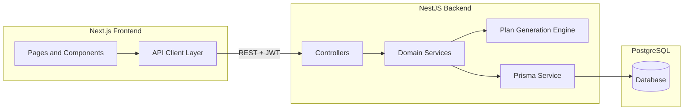
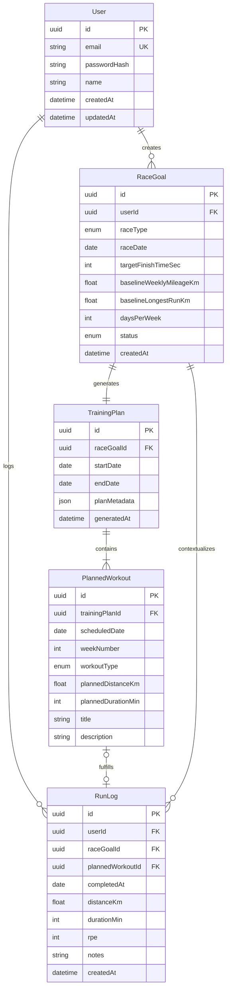
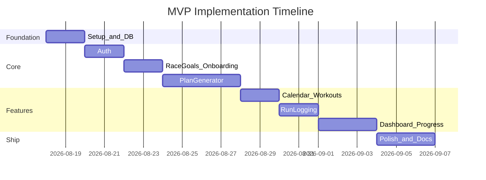

# Marathon Training App — Project Plan

## Architecture Overview



**Recommended repo layout:** monorepo with two apps at the root. Keeps shared types optional later without over-engineering now.

---

## MVP v1 Constraints (approved)

- **Race distance:** marathon only (5K / 10K / half deferred to v2)
- **Schedule:** 3, 4, or 5 running days per week
- **Priority feature:** rule-based training plan generator
- **Explicitly excluded:** AI, Strava/Garmin, GPX uploads, real-time features, native mobile
- **Build approach:** incremental phases; no large code dumps

---

## 1. MVP Scope

### In scope (MVP v1)

| Area                | What ships                                                                                                                                                     |
| ------------------- | -------------------------------------------------------------------------------------------------------------------------------------------------------------- |
| **Auth**            | Email/password register, login, logout; JWT stored in httpOnly cookie or secure client pattern; protected routes                                               |
| **Onboarding**      | Single wizard: marathon race date, optional target finish time, current weekly mileage, longest recent run, days per week (3 / 4 / 5)                          |
| **Plan generation** | Rule-based engine (templates + periodization), one active plan per race goal; regenerate only if goal inputs change                                            |
| **Plan views**      | Full plan list by week; weekly calendar grid; workout detail (type, distance, notes)                                                                           |
| **Run logging**     | Log a run against a planned workout or as a standalone entry: date, distance, duration, optional notes and RPE (1–10)                                          |
| **Progress**        | Dashboard: current week planned vs completed mileage; simple chart or bar summary of weekly totals; countdown to race                                          |
| **Profile**         | View/update baseline stats (weekly mileage, longest run, days/week) for the active goal                                                                        |

### Explicitly out of scope (post-MVP)

- AI coaching, Strava/Garmin sync, GPX upload, maps, social features, push notifications, real-time updates, mobile native app, multi-race simultaneous plans, coach/admin roles, payment

### MVP success criteria

A user can sign up, create one race goal, receive a multi-week plan, see workouts on a calendar, log runs, and see whether they are on track vs the plan.

---

## 2. Database Entities and Relationships



### Entity notes

- **`RaceGoal`** snapshots baseline inputs at creation so plan history stays consistent even if the user updates profile later.
- **`RaceGoal.status`**: `ACTIVE` | `COMPLETED` | `ARCHIVED` — MVP allows one `ACTIVE` goal per user.
- **`TrainingPlan.planMetadata`**: stores generation inputs (total weeks, peak mileage, taper start) for debugging and UI labels without extra tables.
- **`PlannedWorkout.workoutType`**: `REST` | `EASY` | `LONG` | `TEMPO` | `INTERVAL` | `RACE_PACE` (subset used per race distance).
- **`RunLog.plannedWorkoutId`**: nullable; when set, enables planned-vs-actual comparison for that day.

### Key indexes

- `RaceGoal(userId, status)` — fetch active goal
- `PlannedWorkout(trainingPlanId, scheduledDate)` — calendar queries
- `RunLog(userId, completedAt)` — history and weekly aggregates

---

## 3. Backend Modules (NestJS)

Organize by feature modules with thin controllers and testable services.

| Module                    | Responsibility                                                                      |
| ------------------------- | ----------------------------------------------------------------------------------- |
| **`AuthModule`**          | Register, login, JWT strategy, guards, password hashing (bcrypt)                    |
| **`UsersModule`**         | Current user profile (`GET /me`, `PATCH /me`)                                       |
| **`RaceGoalsModule`**     | CRUD for race goals; enforce one active goal; validate race date in future          |
| **`TrainingPlansModule`** | Trigger generation, fetch plan by goal, list weeks; owns **`PlanGeneratorService`** |
| **`WorkoutsModule`**      | Query planned workouts by date range / week; single workout detail                  |
| **`RunLogsModule`**       | Create/update/delete run logs; link to planned workout; weekly aggregates           |
| **`ProgressModule`**      | Dashboard DTOs: planned vs actual mileage by week, race countdown, completion rate  |
| **`PrismaModule`**        | Global Prisma client wrapper                                                        |
| **`HealthModule`**        | `GET /health` for Docker/deploy checks                                              |

### Plan generation engine (core domain logic)

Isolate in [`apps/api/src/training-plans/plan-generator.service.ts`](apps/api/src/training-plans/plan-generator.service.ts):

1. Compute weeks until race (min 4, max ~24 depending on distance).
2. Select a template per `raceType` and `daysPerWeek` (e.g. 4-day marathon: easy, easy, tempo, long).
3. Build mileage progression: start near `baselineWeeklyMileageKm`, peak at ~1.3–1.5× baseline (capped by distance), apply ~10% weekly increase rule.
4. Insert taper (2 weeks marathon / 1 week half) reducing volume ~20–40%.
5. Assign `PlannedWorkout` rows with dates from `startDate` to day before race.
6. Long run capped as % of weekly volume and absolute max by race type.

Keep templates as static config files (JSON/TS constants), not AI—easy to unit test.

### API surface (REST, versioned prefix `/api/v1`)

- `POST /auth/register`, `POST /auth/login`, `POST /auth/logout`
- `GET /users/me`, `PATCH /users/me`
- `POST /race-goals`, `GET /race-goals/active`, `GET /race-goals/:id`, `PATCH /race-goals/:id`
- `POST /race-goals/:id/generate-plan`, `GET /training-plans/:id`, `GET /training-plans/:id/weeks/:weekNumber`
- `GET /workouts?from=&to=`, `GET /workouts/:id`
- `POST /run-logs`, `GET /run-logs`, `PATCH /run-logs/:id`, `DELETE /run-logs/:id`
- `GET /progress/summary`, `GET /progress/weekly?weeks=8`

Use DTOs + `class-validator`; global exception filter; ownership guards so users only access their data.

---

## 4. Frontend Pages and Components

### Pages (Next.js App Router)

| Route                 | Purpose                                                        |
| --------------------- | -------------------------------------------------------------- |
| `/`                   | Marketing landing: value prop + CTA to register                |
| `/login`, `/register` | Auth forms                                                     |
| `/onboarding`         | Multi-step goal setup wizard (redirect here if no active goal) |
| `/dashboard`          | Overview: race countdown, this week stats, quick log CTA       |
| `/plan`               | Full training plan by week (accordion or tabs)                 |
| `/calendar`           | Week/month calendar of planned workouts                        |
| `/workouts/[id]`      | Workout detail + log run form                                  |
| `/runs`               | Run history list with filters                                  |
| `/runs/new`           | Standalone log run (optional link to workout)                  |
| `/progress`           | Weekly mileage chart: planned vs actual                        |
| `/settings`           | Profile + active goal summary                                  |

Protected routes wrapped in an auth layout; middleware redirects unauthenticated users to `/login`.

### Main components

**Layout & shared**

- `AppShell` — sidebar/nav + header
- `ProtectedRoute` / auth middleware integration
- `LoadingSkeleton`, `EmptyState`, `ErrorBoundary`

**Onboarding**

- `GoalWizard` — step container
- `RaceTypeSelect`, `RaceDatePicker`, `TargetTimeInput`
- `BaselineForm` — weekly mileage, longest run, days/week slider

**Plan & calendar**

- `WeekTabs` — navigate plan weeks
- `WorkoutCard` — type badge, distance, date
- `CalendarGrid` — shadcn `Calendar` or custom week grid
- `WorkoutTypeBadge` — color-coded EASY/LONG/TEMPO/etc.

**Logging & progress**

- `LogRunForm` — distance, duration, RPE, notes
- `PlannedVsActualBar` — weekly comparison
- `MileageChart` — recharts or lightweight chart lib
- `RaceCountdown` — days until race
- `ProgressStatCards` — completed runs, weekly total, plan adherence %

**UI library:** shadcn/ui for `Button`, `Card`, `Form`, `Input`, `Select`, `Dialog`, `Tabs`, `Calendar`, `Badge`, `Progress`.

### Frontend data layer

- Typed API client (`lib/api/`) with fetch wrapper attaching credentials
- React Query (TanStack Query) for server state, caching, and mutations
- Zod schemas mirroring backend DTOs for form validation

---

## 5. Project Folder Structure

```
runningApp/
├── apps/
│   ├── web/                          # Next.js 14+ App Router
│   │   ├── src/
│   │   │   ├── app/                  # routes (app router)
│   │   │   │   ├── (auth)/
│   │   │   │   ├── (dashboard)/
│   │   │   │   └── layout.tsx
│   │   │   ├── components/
│   │   │   │   ├── ui/               # shadcn
│   │   │   │   ├── layout/
│   │   │   │   ├── plan/
│   │   │   │   ├── calendar/
│   │   │   │   └── runs/
│   │   │   ├── lib/
│   │   │   │   ├── api/
│   │   │   │   └── utils.ts
│   │   │   ├── hooks/
│   │   │   └── types/
│   │   ├── public/
│   │   ├── tailwind.config.ts
│   │   ├── components.json           # shadcn config
│   │   └── package.json
│   │
│   └── api/                          # NestJS
│       ├── prisma/
│       │   ├── schema.prisma
│       │   └── migrations/
│       ├── src/
│       │   ├── main.ts
│       │   ├── app.module.ts
│       │   ├── common/               # guards, filters, decorators
│       │   ├── auth/
│       │   ├── users/
│       │   ├── race-goals/
│       │   ├── training-plans/
│       │   │   ├── plan-generator.service.ts
│       │   │   └── templates/        # workout templates per race/days
│       │   ├── workouts/
│       │   ├── run-logs/
│       │   ├── progress/
│       │   └── prisma/
│       ├── test/                     # e2e + unit tests for generator
│       └── package.json
│
├── docker-compose.yml                # PostgreSQL + optional api container
├── .env.example
├── .gitignore
└── README.md                         # setup, architecture, screenshots
```

Optional later: `packages/shared-types` for DTOs shared between web and api—skip for MVP to avoid premature abstraction.

---

## 6. Step-by-Step Implementation Roadmap

### Phase 0a — Scaffold only (current step)

- Initialize git repo, root `.gitignore`, `pnpm-workspace.yaml`
- Scaffold `apps/web` (Next.js + TS + Tailwind) and `apps/api` (NestJS)
- `docker-compose.yml` for PostgreSQL
- Verify: `pnpm install`, `pnpm --filter web dev`, `pnpm --filter api start:dev`, `docker compose up -d`
- **Not in this step:** Prisma, auth, shadcn, application features

### Phase 0b — Database layer

- Prisma init in api; define full schema; run first migration
- NestJS `PrismaModule`, `HealthModule`, global validation pipe
- Root README and `.env.example`

### Phase 1 — Authentication (Day 3–4)

- `AuthModule`: register/login, JWT, bcrypt, `@CurrentUser()` decorator
- Web: login/register pages, auth context or cookie handling, route middleware
- `UsersModule`: `GET /me`
- Seed script (optional): demo user for local dev

### Phase 2 — Race goals & onboarding (Day 5–6)

- `RaceGoalsModule` with validation (future race date, realistic baselines)
- Enforce one active goal per user
- Web: onboarding wizard; redirect new users without active goal
- Settings page to view active goal

### Phase 3 — Plan generation engine (Day 7–10)

- Implement `PlanGeneratorService` + template configs for 5K, 10K, half, marathon × 3–6 days/week
- Unit tests for generator: week count, taper presence, mileage monotonicity, rest days
- `POST generate-plan` persists `TrainingPlan` + `PlannedWorkout` rows in a transaction
- Web: `/plan` page with week navigation and workout cards

### Phase 4 — Calendar & workout detail (Day 11–12)

- `WorkoutsModule`: date-range queries optimized for calendar
- Web: `/calendar` week view; `/workouts/[id]` detail page
- Empty/loading states; link from calendar cell to workout detail

### Phase 5 — Run logging (Day 13–14)

- `RunLogsModule`: CRUD, optional link to `PlannedWorkout`
- Validation: no future dates, positive distance/duration
- Web: log form on workout detail + `/runs/new` + `/runs` history list
- Optimistic updates via React Query

### Phase 6 — Progress & dashboard (Day 15–17)

- `ProgressModule`: aggregate planned vs actual by ISO week
- Web: `/dashboard` and `/progress` with stat cards and weekly chart
- Plan adherence metric: % of planned distance completed (excluding rest days)

### Phase 7 — Polish & portfolio readiness (Day 18–21)

- Consistent error handling and toast notifications
- Responsive layout (mobile-friendly calendar)
- E2E smoke test: register → onboard → view plan → log run
- README: architecture diagram, local setup, env vars, demo screenshots
- Optional: deploy web (Vercel) + api/db (Railway/Render/Fly.io)



---

## Engineering Practices (portfolio signals)

- **Testing:** unit tests for `PlanGeneratorService`; API e2e for auth + generate-plan happy path
- **Validation:** DTOs on API; Zod on forms
- **Security:** bcrypt cost factor, JWT expiry, user-scoped queries, no mass assignment
- **Commits:** small, feature-scoped commits with conventional messages
- **Docs:** README architecture section + `.env.example` documenting every variable

---

## What happens after you approve

Implementation will start with **Phase 0** only: scaffold both apps, Docker + PostgreSQL, Prisma schema, and health check—then proceed phase by phase with your go-ahead at each milestone.
